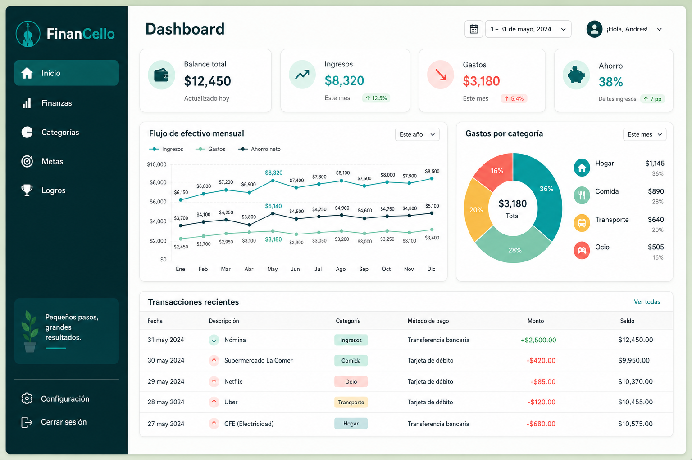

<a id="readme-top"></a>


<p align="center">
  &nbsp;
  &nbsp;
  &nbsp;
  &nbsp;
</p>

<br>

<div align="center">
  
  <h3 align="center">FinanCello Frontend</h3>
  <p align="center">
    Frontend web (Angular) para gestión de finanzas personales y empresariales.
    <br>
    <a href="https://github.com/hexed-AAL1X/FinanCello"><strong>Explorar repositorio »</strong></a>
    <br><br>
    <a href="https://github.com/hexed-AAL1X/FinanCello">Ver código</a>
    ·
    <a href="https://github.com/hexed-AAL1X/FinanCello/issues/new?labels=bug">Reportar bug</a>
    ·
    <a href="https://github.com/hexed-AAL1X/FinanCello/issues/new?labels=enhancement">Pedir feature</a>
  </p>
</div>

<details>
  <summary>Tabla de contenidos</summary>
  <ol>
    <li><a href="#about-the-project">About the project</a></li>
    <li><a href="#built-with">Built with</a></li>
    <li><a href="#important-notices">Important notices</a></li>
    <li>
      <a href="#getting-started">Getting started</a>
      <ul>
        <li><a href="#prerequisites">Prerequisites</a></li>
        <li><a href="#installation">Installation</a></li>
        <li><a href="#available-scripts">Available scripts</a></li>
      </ul>
    </li>
    <li><a href="#environments">Environments</a></li>
    <li><a href="#deployment">Deployment</a></li>
    <li><a href="#contributing">Contributing</a></li>
    <li><a href="#contact">Contact</a></li>
  </ol>
</details>
<br>

<a id="about-the-project"></a>***About the project***

FinanCello es una aplicación web enfocada en ayudarte a administrar tus finanzas.

Incluye:

- Landing page con modal de autenticación.
- Dashboard y módulos para categorías, movimientos, metas de ahorro y más.

<p align="center">
  
</p>

<p align="right">(<a href="#readme-top">back to top</a>)</p>

<a id="built-with"></a>***Built with***


- 
- 
- 
- 
- 

<p align="right">(<a href="#readme-top">back to top</a>)</p>

<a id="important-notices"></a>***Important notices***

> [!NOTE]
> No necesitas instalar `ng` globalmente. Este proyecto ya incluye Angular CLI en `devDependencies`.
>
> Usa `npm run start` para levantar el servidor local.

> [!IMPORTANT]
> Este repo es el **frontend**. Para autenticarte y usar el dashboard necesitas un backend corriendo y configurar `apiUrl` en los environments.

<p align="right">(<a href="#readme-top">back to top</a>)</p>

<a id="getting-started"></a>***Getting started***

<a id="prerequisites"></a>

### Prerequisites

- Node.js (recomendado: LTS)
- npm

<a id="installation"></a>

### Installation

1) Clonar el repositorio

```bash
git clone https://github.com/hexed-AAL1X/FinanCello.git
cd FinanCello
```

2) Instalar dependencias

```bash
npm install
```

3) Ejecutar en modo desarrollo

```bash
npm run start
```

4) Abrir en el navegador

- `http://localhost:4200/`

<a id="available-scripts"></a>

### Available scripts

```bash
npm run start        # ng serve
npm run build        # build producción
npm run build:netlify
npm run test
```

<p align="right">(<a href="#readme-top">back to top</a>)</p>

<a id="environments"></a>***Environments***


Los environments están en:

- `src/app/environments/environment.ts` (dev)
- `src/app/environments/environment.prod.ts` (prod)

En producción se usa `environment.prod.ts` mediante `fileReplacements` en `angular.json`.

Variables relevantes:

- `apiUrl`: URL del backend (`/api/v1`)

<p align="right">(<a href="#readme-top">back to top</a>)</p>

<a id="deployment"></a>***Deployment***


### Netlify

Build command:

```bash
npm run build:netlify
```

Publish directory:

- `dist/financello-landing`

<p align="right">(<a href="#readme-top">back to top</a>)</p>

<a id="contributing"></a>***Contributing***

Contribuciones bienvenidas.

1) Fork del proyecto
2) Crear una rama (`git checkout -b feature/nueva-feature`)
3) Commit (`git commit -m "Add: ..."`)
4) Push (`git push origin feature/nueva-feature`)
5) Pull Request

<p align="right">(<a href="#readme-top">back to top</a>)</p>

<a id="contact"></a>***Contact***

<p align="center">
  <a href="mailto:hexed_aal1x.ops@proton.me"></a>
  <a href="https://www.instagram.com/hexed_aal1x"></a>
  <a href="https://www.linkedin.com/in/leonardo-bravo-4120b8228/"></a>
</p>
<p align="right">(<a href="#readme-top">back to top</a>)</p>
